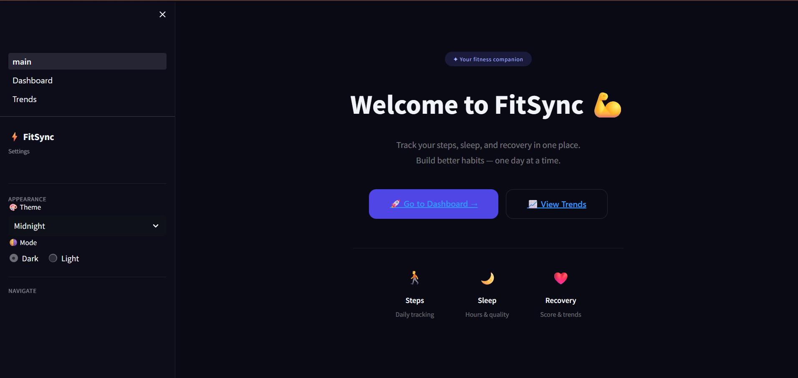
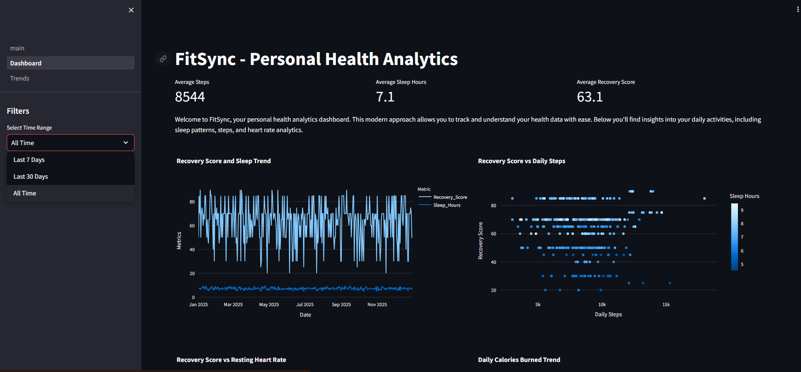
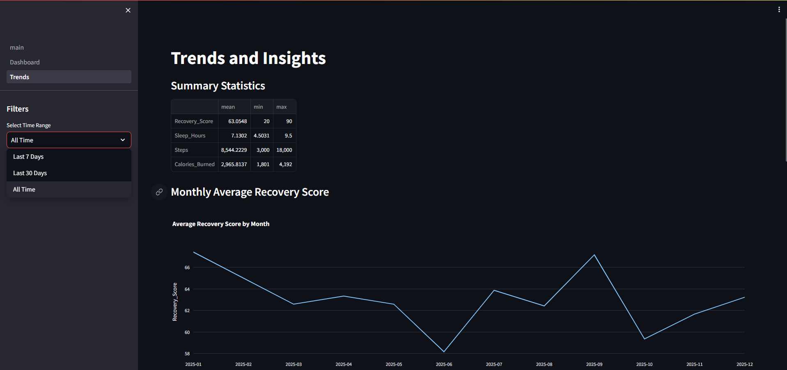

## 🚀 FitSync
Your Personal Health Analytics Platform

## 📌 Project Overview

FitSync is a personal health analytics dashboard built using Python and Streamlit. It provides users with insights into their daily health data like steps, sleep, and recovery score through a clean and interactive interface. The application is divided into three pages—Main, Dashboard, and Trends—each serving a specific purpose for better user experience. This project highlights strong skills in data analysis, UI design, and building real-world interactive applications.

## 🛠️ Tech Stack

## ✨ Key Features
🏠 Main Page – Clean landing page with theme switch (Dark/Light mode) and navigation buttons   
📊 Dashboard Page – Displays key KPIs and interactive charts for steps, sleep, and recovery    
📈 Trends Page – Shows histograms and deeper insights for better understanding of data       
🎨 Dark Theme Support – Modern UI for better visual experience                               
⚡ Caching – Faster data loading and improved performance                                   
🔄 Dynamic Filtering – Real-time updates based on selected time range
🤖 Automated Trends – Insights generated from processed data                                 

## 📸 Screenshots

## 🏠 Main Page
                                                      
                                                   
## 📊 Dashboard Page
                                              

## 📈 Trends Page

## ▶️ How to Run
Clone the repository                           
Open a new GitHub Codespace              
Run the following command in the terminal:                               
streamlit run main.py
## 🌐 Live Demo

👉 https://fitsync-project-utkarsh-palgit-jg2rujms8rxgaxmbesga5p.streamlit.app/

## 🤖 Built with AI

This project was developed with the help of Continue Agent in GitHub Codespaces to speed up development and improve productivity. AI was mainly used for syntax assistance and quick suggestions, while all major decisions related to project structure, logic, and data processing were implemented independently.

## 💡

This project demonstrates the ability to build interactive dashboards, work with real-world data, and design clean user interfaces using Python.